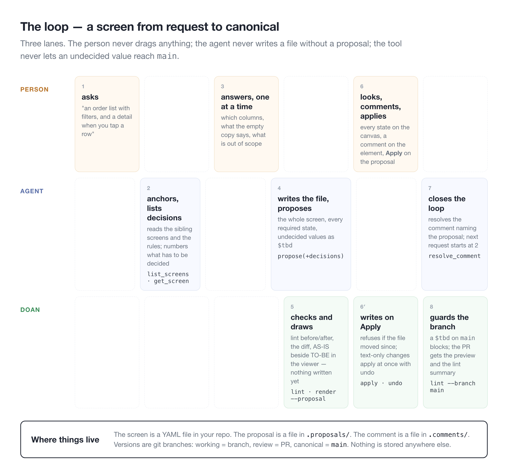

# doan

[한국어](README.ko.md) · **English**

**도안** — the Korean word for a design drawing, the plan a thing is made from.

Imagine every screen of your product is a short text file. It says what is on the screen, what it looks like when it is empty or loading or broken, where each button goes, and which spec it came from. An AI agent writes those files. You open a page in your browser, point at an element, and say "drop that column" or "the empty message should be warmer." The agent proposes a new version — with the diff, the lint result and the decisions it was based on — and you press **Apply**. Versions are git. No canvas, no dragging, no design file drifting away from the code.

It replaces Figma for product screens — web and app. Decks, diagrams, vectors and marketing stay wherever they are.

**You do not write code to use it.** You talk to the agent you already have (Claude Code, Cursor, Codex) and look at a web page. The command line is there for the people and machines that want it: CI, scripts, a quick check.

[What it solves](#what-it-solves) · [Who it's for](#who-its-for) · [The whole loop](#the-whole-loop) · [Your first five minutes](#your-first-five-minutes) · [What a screen file says](#what-a-screen-file-says) · [The viewer](#the-viewer) · [What lint catches](#what-lint-catches) · [Already drew it in Figma?](#already-drew-it-in-figma) · [Web and app](#web-and-app) · [Why files and a command line](#why-files-and-a-command-line) · [Commands](#commands) · [Configuration](#configuration)

<details>
<summary>If any of the words below are new — ten of them, one line each</summary>

| Word | What it means here |
|---|---|
| **screen file** | One YAML text file per screen. The whole design of that screen, in words a person and a machine both read |
| **state** | What a screen looks like in a moment: Empty, Loading, Error. Written as *what changes* from the default, not as a second copy |
| **variant** | What a screen *is* for a record or mode — an edit dialog in Create mode vs Edit mode. Same shape as a state |
| **`$tbd`** | A value nobody has decided yet. It is a real value with an owner, not an empty string — so it can be counted, shown and blocked |
| **lint** | A check that reads every screen file and says what is missing or wrong, with the file and line. Like a spell-checker for screens |
| **proposal** | A new version of one screen the agent wants to write, waiting for a person to apply or reject it |
| **viewer** | The web page that draws the files: every screen, every state, an inspector, comments, Apply / Reject |
| **MCP** | The standard by which agents call tools. doan is one such tool; any agent that speaks MCP can use it |
| **conventions** | Your team's rules, in one file: how screens are named, which states each type needs, what a kind maps to |
| **component base** | What the picture is drawn with: a library (antd, MUI) or your own copy of the bundled set |

</details>

## What it solves

A design file rarely breaks when one person owns it. It breaks when there are several people, dozens of screens, an agent writing some of them, and a few months of history.

- **The screen nobody drew.** "What shows when the list is empty?" You find out that screen does not exist when engineering asks. doan knows a list screen needs an Empty state and says so before anyone asks.
- **The value nobody decided.** A placeholder string that looked fine in review ships. In doan an undecided value is `$tbd` — counted, owned, visible as a yellow dot, and blocking on `main`.
- **The design that drifted from the code.** Figma has one truth, the repo another. Here the screen *is* a file in the repo: branch, PR, diff, blame — the same tools, the same history.
- **The agent that edits behind your back.** An agent that can write files will. In doan it can only *propose*; a person applies, and `apply` refuses if the file moved since.
- **The arrow to nowhere, the pixel that escaped, the state that patches a ghost.** Fifteen checks, each with a line number.

## Who it's for

- **A designer or PM who plans and builds with an agent** and wants the design to be a record, not a chat transcript. You look, comment and approve; you never drag.
- **An engineer** who wants the design next to the code, reviewable in a PR, checkable in CI, with real component names in the handoff.
- **A team on Figma today** that wants to try the other side of the bet without redrawing: `import figma` brings a page in.

Not for: decks, illustration, marketing pages, or anyone who wants to move boxes by hand. That is what Figma is for, and doan does not pretend otherwise.

## The whole loop



Read it left to right. The person speaks twice (what they want, then answers) and acts once (Apply). The agent reads before it writes and never writes without a proposal. doan sits under both: it checks, draws the proposal side by side with the current screen, writes only on Apply, and keeps `main` clean.

Five steps, in your hands. ④ goes round as often as it needs to.

```
① start ─→ ② draw ─→ ③ look ─→ ④ fix ─→ ⑤ hand off
                        ↑          │
                        └──────────┘
```

### ① Start — once per project

```bash
npx @junyoung735/doan init design
```
```
design/
├── conventions.yaml   the rules — screen name shape, required states per type, breakpoints, what applies at once
├── sections.yaml      the sections, like "03. Orders - Order list"
├── tokens/            colour, space, type (DTCG) and a light/dark resolver
├── components/        one contract per kind — every part the agent may use
├── assets/            icons and pictures
└── screens/           the screen files; a starter to begin with
```

Register the server in `.mcp.json` (see "Your first five minutes") and the agent has doan's tools.

### ①½ Foundations — once, before screens

```
you      I want it to feel like this kiosk [reference image]
agent    (foundation interview) surfaces · text styles · colour roles · density · pictures, one at a time,
         then tokens/ and contracts through propose_files → the proposal page: foundations board AS-IS | TO-BE
you      Apply
```
The design system is three layers — foundations (`tokens/`: colour roles, text styles, surfaces, scales, fonts), components (`components/`) built on them, and assets beside them; screens use components only. `foundations.html` (Design system › Foundations) is what the product looks like, on one page, with the raw variables a tab away. A contract binds a whole style with `font: text.heading` or `surface: surface.tile`. A new component takes the same road through the `component` interview.

### ② Draw — by talking to the agent

```
you      An order list. Filters, and a detail when you tap a row.

agent    Five things to decide.
         1 filter fields  2 table columns  3 empty-state copy  4 row tap: push or modal?  5 an export button
         Starting with 1 — order-detail uses period and branch, so I suggest period, branch, status. OK?

you      ok
         …(one at a time)…

agent    ┌──────────────────────────────────────┐
         │ Orders                      [Export] │
         │ [period ▾] [branch ▾] [status ▾]     │
         │ ┌──────────────────────────────────┐ │
         │ │ order_no  branch  amount  status │ │
         │ │ …                                │ │
         │ └──────────────────────────────────┘ │
         │                            ‹ 1 2 3 › │
         └──────────────────────────────────────┘
         Empty    table becomes "No orders match.", paging hidden
         Loading  table becomes a 10-row skeleton
         Error    table becomes an error notice — copy is the PM's to decide ($tbd)
         Proposing this.

you      go
```

This is the file the agent writes (trimmed). A state is not a copy but "what differs from Default", and a value nobody decided is a `$tbd` with an owner.

```yaml
# screens/order-list.yaml
screen: order-list
type: list                                  # a list must have Empty, Loading and Error
elements:
  - { id: header, kind: page-header, title: Orders, actions: [{ id: export, kind: button, label: Export }] }
  - { id: filter, kind: filter-form, fields: [period, branch, status] }
  - { id: table,  kind: table, columns: [order_no, branch, amount, status, ordered_at] }
  - { id: paging, kind: pagination }
states:
  Empty:   [{ target: table, replace: { kind: empty-notice, text: "No orders match." } }, { target: paging, hide: true }]
  Loading: [{ target: table, replace: { kind: skeleton, rows: 10 } }]
  Error:   [{ target: table, replace: { kind: error-notice, text: { $tbd: { owner: pm } } } }]
flows:
  - { from: table, via: row, to: order-detail }
```

### ③ Look — in the viewer

```bash
npx @junyoung735/doan serve design          # http://127.0.0.1:4870/
```
```
┌ design ─────────────┬─ Orders      [Canvas] Prototype       − 45% + ┬─ Inspect ────────────┐
│ Overview            │                                               │ order-list-Default   │
│ Design system       │  order-list-Default ───row───▶ order-detail    │ file order-list.yaml │
│   Tokens Components │  ┌────────────┐             ┌────────────┐   │ [screen] [▶ Prototype]│
│ Search ⌘F           │  │ Orders     │             │ #1042      │   │ [developer spec]     │
│ ▾ Orders            │  │ [▾][▾][▾]  │             │ …          │   │                     │
│   order-list  ●     │  │ ▤▤▤▤▤▤▤▤   │             └────────────┘   │ Flows                │
│     Default         │  └────────────┘                              │  table → order-detail│
│     Empty           │  order-list-Empty                            │                     │
│     Loading         │  ┌────────────┐                              │                     │
│   order-detail      │  │ No orders  │                              │                     │
└─────────────────────┴──────────────────────────────────────────────┴─────────────────────┘
  left: where to go          middle: a frame per state, flow arrows between       right: what you clicked
```

**Prototype** at the top is click-through along the arrows; **Design system** on the left is the tokens, components and assets pages. `●` is a pill: a lint finding, an undecided value or an open comment.

### ④ Fix — with comments

```
click the Export button in the viewer → comment in the panel: "say 'Download'"
        │
        ▼
you → agent      "work through the comments"
        │
        ▼
agent            reads the comments → reads the file → proposes
        │
        ├─ wording only, lint clean ──▶ applied at once, undo kept          ← this one
        └─ structure changes ────────▶ waits on its proposal page ──▶ Apply / Reject
        │
        ▼
comment closed.  to take it back: "undo that"
```

A proposal page is the decisions table, what changes, and every state AS-IS beside TO-BE:

```
AS-IS                                        TO-BE
actions: [{ id: export, label: Export }]     actions: [{ id: export, label: Download }]
```

A missing state or an undecided value is a lint finding with a file and line, and a pill on the overview. A `$tbd` cannot reach `main`.

```
$ npx @junyoung735/doan lint design
warn   L08  screens/order-list.yaml:38  states.Error.0.replace.text  $tbd (pm, due 2026-10-02)
BLOCK  L11  screens/order-list.yaml:3   screen  on main: 1 $tbd, 0 blocking finding(s)
```

### ⑤ Hand off — to developers

```
click a frame on the canvas → panel [developer spec] → the spec page → [Copy as Markdown] → paste into the ticket
```
```
┌ order-list  Spec                                        [Copy as Markdown] [screen] ┐
│ Acceptance 7                                                                     │
│ ☐ the screen has every state its type requires (Default, Empty, Loading, Error)  │
│ ☐ Empty: table becomes empty-notice "No orders match."                           │
│ ☐ Empty: paging is hidden                                                        │
│ ☐ table.row → order-detail                                                       │
│ Elements 5                                                                       │
│  id      kind     Code                                     props                 │
│  export  button   <Button kind="secondary">Export</Button>  label Export         │
│  table   table    antd/Table, mui/Table                    columns order_no …    │
│ States · Flows · Copy · Tokens used · Components · Open questions 1 (pm) · lint  │
└──────────────────────────────────────────────────────────────────────────────────┘
```

The Code column comes from `maps_to.code` in the kind's contract (Code Connect's counterpart); a kind without one shows its adapter target or the bundled set. Pasted, it is this ticket:

```markdown
# order-list — developer spec
## Acceptance
- [ ] the screen has every state its type requires (Default, Empty, Loading, Error)
- [ ] Empty: table becomes empty-notice "No orders match."
- [ ] Empty: paging is hidden
- [ ] table.row → order-detail
## Elements
| id | kind | Code | props | path |
| export | button | <Button kind="secondary">Export</Button> | label: Export; variant: secondary | elements.0.actions.0:14 |
```

A developer's agent gets the same through the MCP `handoff` tool. When the screen is settled, one more line:

```
developer → Claude Code   "get the order-list spec from doan and build it"
you       → agent         "order-list is ready"   →  status: ready  →  shown on the overview and tree; L27 if a $tbd remains
```

The agent gets this discipline from the tool itself — the MCP server ships a `draw` prompt: anchor to the nearest screen, list what has to be decided, ask one thing at a time with a recommendation, table the answers, propose with the decisions attached, render, wait. Any agent that connects draws the same way.

## Your first five minutes

Node 20 or newer is the only requirement. No clone, no account.

```bash
npx @junyoung735/doan init design --base antd   # or --base none: the component set is copied into design/ and is yours
npx @junyoung735/doan serve design              # http://127.0.0.1:4870/
```

`design/` now holds `conventions.yaml` (your rules), `sections.yaml`, `tokens/` (DTCG token files and a light/dark resolver), a starter screen and its own README. Open the viewer and click the starter screen: state tabs, a picture, a drawer that says which file and line each element came from. The viewer opens on the domain canvas: the page a Figma file had per domain — sections side by side, a column per screen with its states stacked, arrows between them, at real size with zoom and pan.

Let an agent in. Claude Code — `.mcp.json` in the project:

```json
{ "mcpServers": { "doan": { "command": "npx", "args": ["-y", "@junyoung735/doan", "mcp", "design"] } } }
```

Cursor takes the same JSON in `.cursor/mcp.json`; Codex takes it in `~/.codex/config.toml`:

```toml
[mcp_servers.doan]
command = "npx"
args = ["-y", "@junyoung735/doan", "mcp", "design"]
```

Then ask the agent for a screen — "an order list with filters, and a detail when you tap a row." It will ask you a few things, propose, and tell you where to look. Press Apply. That is the loop.

To see doan with real screens in it first, clone and `npm run demo` — six admin screens under generic names, drawn with antd.

## What a screen file says


Two things make the file worth reading in a pull request. **States are patches** — `Empty` says what is different, which is exactly the reviewer's question — and **nothing is silently missing**: a required state that is not there fails lint, and a value nobody decided is `$tbd` with an owner. The file also knows where it came from: `refs` point at the spec entry and the ticket as typed URIs, so nobody has to ask.

`variants:` uses the same patch shape for what a screen *is* — an edit dialog for a counted item vs a cup, a form in Create vs Edit mode — as opposed to what it is *doing* (Empty, Loading). The distinction came out of transcribing six real screens; it is in `DESIGN.md` §12.

Placement is two words — `align` is horizontal, `justify` vertical, whatever the direction — and `columns` may be the tracks themselves (`"1fr auto auto"`).

`breakpoints:` uses it once more for width: `conventions.breakpoints` names the widths (mobile 390, tablet 768, desktop 1280 in the example), and a screen that must work at several lists per name what changes — a tile grid that goes from 25 columns to 10, a stat strip that wraps and then scrolls — applied last, on top of the state. Layout adapts on its own before that: `columns: auto` with a `min` size class, `wrap: true`, `scroll: horizontal`.

## The viewer


A sidebar lists every screen by section with pills for blocking findings, undecided values and open comments. A screen page shows one state at a time as tabs — variants too — or every state side by side with **compare states**, scaled to fit.

A screen with breakpoints gets a tab per width beside the state tabs, each a frame at that width; the prototype gets a breakpoint select. The viewer itself folds for narrow windows: the inspect panel becomes a toggle under 1180px, the sidebar a menu button under 860px.


On the picture, meta information is only a dot: grey for a condition (`show_when`), yellow for an undecided value, blue for a comment. Empty cells carry sample values made from the column name, so a screen reads as a screen; the drawer says they are samples.


Click any element and the drawer says what it is, which design-system component it maps to, its conditions and props, and the file, YAML path and line it came from. In the live viewer (`serve`) the drawer also takes a comment, anchored to that path — which is what the agent reads next.


A proposal is its own page: the decisions agreed before it was written, what changes, and every state AS-IS beside TO-BE. Apply with your name, or Reject. Text-only changes that keep lint clean apply at once, with undo; anything structural waits here.

## Handing off to developers

A tool that skips Figma has to hand off better than Figma. Every screen has a spec page — `spec-<screen>.html`, or `doan spec <dir> <screen> --md` for a ticket — read off the file: the elements with their props and copy and the component each maps to in the team's code (`maps_to.code` in a contract, Code Connect's counterpart), what every state and breakpoint changes, the flows, the tokens with their CSS variables, the assets, the open `$tbd` questions, and acceptance criteria written from all of that. A coding agent gets the same spec through the MCP `handoff` tool. Tokens leave as `doan tokens --format css` or `--format tailwind`. Mark a screen `status: ready` when it is; lint says if a `$tbd` is still open.

## What lint catches


Every finding names the file, the YAML path and the line, so an agent can edit the exact spot and a person can click through from the viewer. Exit code 1 on blocking, which is what makes a pull request go red like a failing test. The rules a team writes for itself — which states each screen type needs, which words a layout may use, which gestures a flow may name — live in `conventions.yaml`; a key left empty switches that check off rather than firing wrongly.

## Already drew it in Figma?


Two commands and a personal access token (`FIGMA_TOKEN`, read scope). Run `map figma` first — it pairs the page's component masters with kinds by name — then `import figma`. Frames named `{screen}-{state}` become one file per screen with the other states as patches; auto-layout becomes layout in token names; prototype links become flows. Whatever cannot be resolved is a `$tbd` owned by `import`, so the first lint after an import is an honest to-do list. `<file-key>` is the part of the Figma URL after `/design/`.

## Web and app


The format is platform-neutral; the picture is not. A screen says `platform: ios` (or `android`, `tablet`, `web`), the project sets a default, and `render` draws it at that platform's width inside its frame — a phone with status bar and home indicator, a tablet, a bare web canvas. Twelve mobile kinds ship by name because iOS HIG and Material both have them (`app-bar`, `tab-bar`, `list-cell`, `bottom-sheet`, `fab`, `snackbar`, …). Flows carry a `gesture` and a `nav` (push, modal, sheet, tab, dismiss). `examples/mobile-app` is a three-screen consumer app.

### Drawing with your own components


`--base antd` or `--base mui` maps kinds to that library's components and draws them server-side, themed from your `tokens/`. `--base none` copies the bundled set into `design/components/` — from then on it is your component library, and the tool never owns it; that is also the road for shadcn/ui and any in-house system. The viewer's own words follow `meta.language` in conventions (`en`, `ko`); screen content is never translated. Every kind is a file under `components/` — its props, slots and the tokens it binds — and the viewer's Components page draws them all from those files. The overview's flow map lays every screen out from its flows — a box per section, a thumbnail per screen, an arrow to the state it names — computed by ELK when the page is drawn (`npm install elkjs`; optional). The Prototype page is the same screens, pressable: a flow's `from` element is a hotspot and pressing it lands on the target screen and state.

## Why files and a command line


This is the part that is easy to mistake for a developer-only choice. It is the opposite: because the engine is a set of verbs over files, every door gets the same behaviour for free. A designer in the viewer, an agent over MCP and a CI job on a pull request are all running `lint` — the same fifteen rules, the same JSON. A rule added once is enforced everywhere at once. And because it is files, the versioning, the review flow and the history are git's, not a feature to build and trust.

## Commands

All of them: `npx @junyoung735/doan <verb>` (or `doan <verb>` after `npm i -g @junyoung735/doan`). Every one prints JSON with `--json`; the MCP server exposes the same verbs with the same output.

| verb | what it does |
|---|---|
| `init <dir> [--base none\|antd\|mui]` | start a project; `none` copies the component set into it, a library base maps kinds to that library |
| `bases` | the component bases and whether each is ready |
| `tokens <dir>` | every token with its value, per-theme values, file and tier (primitive · semantic · bundled) |
| `assets <dir>` | every file under `assets/` with who names it, the references that name no file, the files nothing names |
| `components <dir>` | every kind's contract — props, slots, token bindings, compound or not |
| `migrate kinds <dir>` | move the rows of `conventions.kinds` into `components/<kind>.yaml` (a project from before 0.4) |
| `lint <dir>` | schema check + rules L01–L20; every finding has file, YAML path and line; exit 1 on blocking |
| `prep <file>` | stub the states the screen type requires and the file lacks, as `$tbd` placeholders |
| `diff <a> <b>` · `diff <file> --from <ref>` | AS-IS / TO-BE between two versions; elements compared by id |
| `render <dir> [--components antd\|mui] [--proposal <id>]` | static HTML: index (with the flow map), a canvas per domain, tokens, components, assets, prototype, one page per screen, one per pending proposal |
| `serve <dir> [--port] [--components …]` | the live viewer: comments, Apply / Reject, `/api/lint` |
| `propose <dir> <screen> --with <new.yaml>` | queue a new version with diff, lint delta and tier |
| `proposals <dir>` · `apply <dir> <id> --by <name>` · `reject <dir> <id>` · `undo <dir> <id>` | the rest of the loop |
| `map figma <dir> <key> --page "…" [--write]` | pair a Figma page's component masters with kinds (`maps_to.figma` in `components/<kind>.yaml`) |
| `import figma <dir> <key> --page "…"` | one screen file per frame group; states as patches; unresolved → `$tbd` |
| `mcp <dir>` | the MCP server on stdio |

## Configuration

```
design/
├── conventions.yaml     naming · platforms · screen types and their required states · layout vocabulary · flow vocabulary · lifecycle · meta.language
├── sections.yaml        the feature groups, in order
├── tokens/              DTCG 2025.10 — primitive · semantic · light · dark · theme.resolver.json; a flat tokens.json still reads
├── components/          one contract per kind (<kind>.yaml): props, slots, token bindings, and for a compound part its elements; with --base none also kinds.js, your copy of the drawing set
├── screens/*.yaml       one file per screen
├── .proposals/          the edit loop's queue
└── .comments/           comments per screen (travel with the branch)
```

`conventions.example.yaml` is the annotated schema of the rules file. Every value in it is an example, not a default: a key a team might do differently ships `null` or empty, and a check whose key is empty is skipped rather than fired wrongly.

## Where the rules come from

The checks are lifted from the [`fig` plugin](https://github.com/byjunyoung/claude-product-skills), which has been run on one company's Figma files across several products since mid-2026. What migrated is the rule set — required states per screen type, `A --> B` flows, blocking vs warning, canonical vs working — not the Figma-only code. Six of that company's admin screens were transcribed under generic names into `examples/store-ops`; two of its Figma pages were the import field test. What each taught the format is in [DESIGN.md](DESIGN.md) §12, with every other decision and its reason. What changed when is in [CHANGELOG.md](CHANGELOG.md); how to change things is in [CONTRIBUTING.md](CONTRIBUTING.md).

## Development

```bash
npm test          # 119 tests, node:test, no framework
npm run check     # tests + lint both examples + render one — what CI runs on Node 20 and 22
npm run demo      # the viewer on examples/store-ops with antd
```

Dependencies: `yaml`, `ajv`, `@modelcontextprotocol/sdk`, `zod`. `react`, `react-dom`, `antd`, `@ant-design/cssinjs`, `@mui/material` and `@emotion/*` are optional and only loaded by the adapter that needs them. The illustrations are HTML in `docs/img/src`, rendered by `docs/img/src/render.sh`.

MIT · [Junyoung Kim](https://github.com/byjunyoung)
