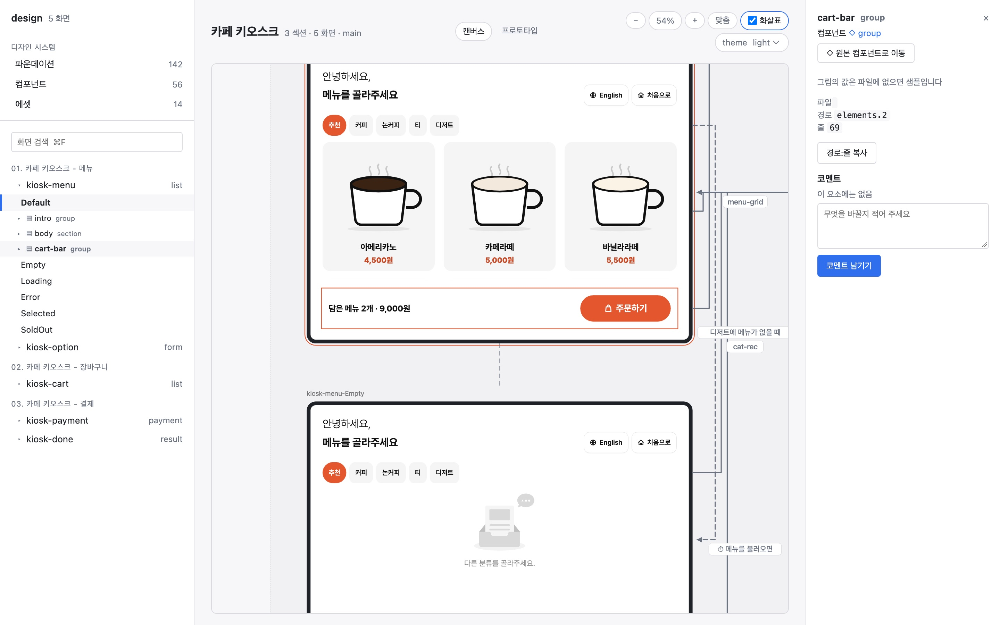
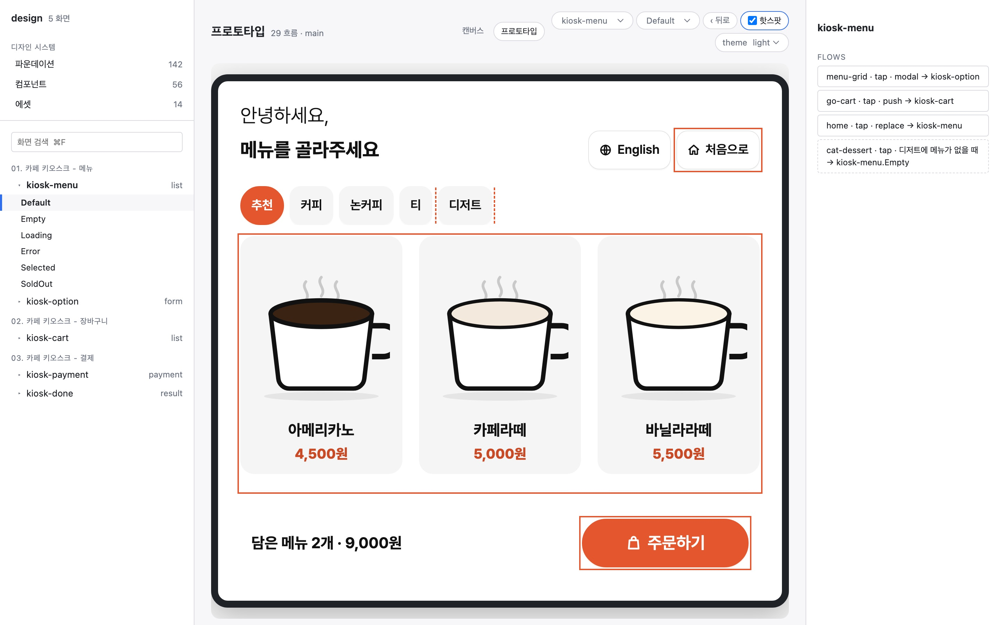
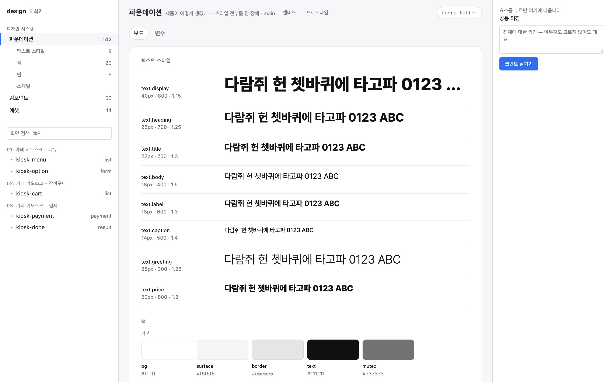
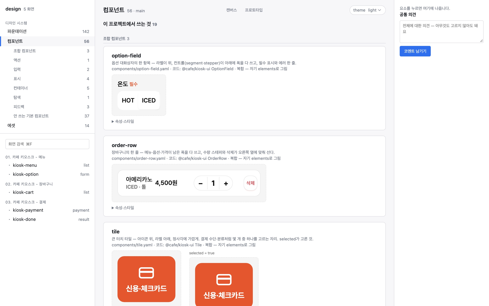
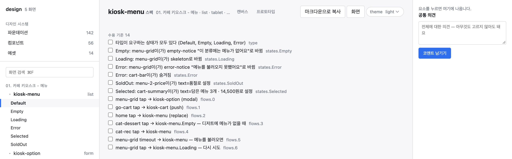

# doan

[한국어](README.ko.md) · **English**

**doan** (도안) — Korean for the drawing a thing is made from.

Product screens are written as YAML files. An AI agent writes them. People look at them in the browser, leave comments and press **Apply**. git keeps the versions. doan replaces Figma for product screens, on web and app. Decks, illustration and marketing stay where they are.

You don't need to write code. Ask the agent you already use (Claude Code, Cursor, Codex) and check the result in the viewer.



## The loop

```
① start ─→ ② foundations ─→ ③ draw ─→ ④ look ─→ ⑤ fix ─→ ⑥ hand off
                                        ↑         │
                                        └─────────┘
```

| Step | You | doan |
|---|---|---|
| ① start | `init`, once | makes the rules, tokens, components and screens folders |
| ② foundations | show a reference, answer questions | proposes colours, text styles and surfaces into `tokens/` and the contracts |
| ③ draw | "an order list; a row opens the detail" | asks what is open, one question at a time, and proposes the screen file |
| ④ look | check the canvas and the prototype | a frame per state, flow arrows, a clickable prototype |
| ⑤ fix | comment on an element or a screen, then "apply the comments" | a proposal with AS-IS / TO-BE, which you apply |
| ⑥ hand off | copy the developer spec | acceptance criteria, elements, code mapping and tokens on one page |

The agent can't edit files directly. It can only **propose**. You apply, and if the file changed in the meantime the apply is refused.

## First five minutes

Node 20 or later.

```bash
npx @junyoung735/doan init design --base antd   # --base none: copy the component set and own it
npx @junyoung735/doan serve design              # http://127.0.0.1:4870/
```

Connect your agent. Claude Code reads the project's `.mcp.json` and Cursor reads `.cursor/mcp.json`:

```json
{ "mcpServers": { "doan": { "command": "npx", "args": ["-y", "@junyoung735/doan", "mcp", "design"] } } }
```

Then ask the agent for a screen.

## A screen file

```yaml
screen: order-list
type: list                                  # a list must have Empty, Loading and Error
elements:
  - { id: filter, kind: filter-form, fields: [period, branch, status] }
  - { id: table,  kind: table, columns: [order_no, branch, amount, status] }
states:                                     # a state is what differs, not a copy
  Empty:   [{ target: table, replace: { kind: empty-notice, text: "No orders yet" } }]
  Loading: [{ target: table, replace: { kind: skeleton, rows: 10 } }]
  Error:   [{ target: table, replace: { kind: error-notice, text: { $tbd: { owner: pm } } } }]
flows:
  - { from: table, via: row, to: order-detail }
```

`lint` reports a missing state or an undecided value (`$tbd`) with its file and line number. On `main` it blocks them.

## The viewer



**Prototype.** Click through the flows. A flow that fires after a delay plays by itself.



**Foundations.** Text styles, colours, surfaces and scales on one page. The raw values are on the Variables tab.



**Components.** The ones this project uses come first, grouped by category. Right-click an element on the canvas to go to its main component.



**Developer spec.** Acceptance criteria, elements with their code mapping, states and flows, and the tokens used. Copy it as Markdown into a ticket. A coding agent gets the same spec through the MCP `handoff` tool.

## Commands

`npx @junyoung735/doan <verb>`. Every verb takes `--json`, and the MCP server exposes the same verbs.

| Verb | What it does |
|---|---|
| `init` · `serve` · `render` | start a project, run the live viewer, write static HTML |
| `lint` · `prep` · `diff` | check (exit 1 on a block), fill missing states, compare AS-IS / TO-BE |
| `propose` · `apply` · `reject` · `undo` | the proposal loop |
| `map figma` · `import figma` | turn a Figma page into screen files |

`doan --help` lists all of them. [DESIGN.md](DESIGN.md) has the design decisions and why they were made, and [CHANGELOG.md](CHANGELOG.md) has what changed.

## Development

```bash
npm test          # node:test
npm run check     # tests + lint and render the examples (CI)
npm run demo      # examples/store-ops with antd
```

MIT · [Junyoung Kim](https://github.com/byjunyoung)
